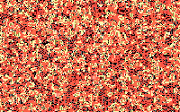

# LifeFade



A pretty and GPU-only implementation of Conway's Game of Life using GLSL (GL Shader Language) and SFML as a graphics library. Individual shader files are in src/shaders, but are unused in the built project: the shaders are embedded as strings for simplicity.

To build and run:

```bash
brew install git cmake make gcc # if you don't have Xcode
git clone --recursive [this repo] # to get the libfmt dependency
brew install sfml # or however you'd install SFML on your system

mkdir build
cd build
cmake ..
make
./lifefade
```
